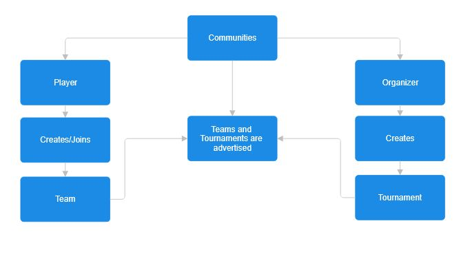

== 2 Descriptive Part

=== 2.1 Domain Description
This section describes the essential components and interactions within an the esports tournament platform. It defines how players, teams, and organizers interact through the platform and identifies the terminology and conceptual abstractions that structure the system. The description includes a rough sketch of the domain, key terms, a narrative of typical processes, and breakdowns of events, actions, behaviors, and function signatures.

=== 2.1.1 Rough Sketch
* [.hl-red]#Players register in a community and can either create new teams or join existing ones advertised within the platform.#
* [.hl-red]#Each team designates a captain, who manages invitations, roster changes, and tournament registrations.#
* [.hl-red]#Organizers publish tournament announcements with eligibility rules such as age limits, roster size, or regional restrictions.#
* [.hl-red]#Teams submit their rosters before the registration deadline, depending on the ruleset, limited roster chances may be permitted later.#
* [.hl-red]#Tournament seeding is determined by prior rankings, past results, or qualifiers.#
* [.hl-red]#Supported formats include single-elimination, double-elimination, Swiss, or round-robin.#
* [.hl-red]#Teams must check in before each match; missing a grace period may cause a forfeit.#
* [.hl-red]#Results are recorded; tiebreakers decide standings in round-robins or Swiss.#
* [.hl-red]#Spectators and media follow brackets, standings, and schedules.#

[.hl-green]#The following are statements people would say in their day to day life.#
* [.hl-green]#"I have a difficult time making friends and I wanted to be able to be apart of a commmunity that enjoyed the same games I do. As well as participate in a variety of events with them."#
* [.hl-green]#"Ive been playing Super Smash Bros day and night but dont have anyone to play against. I want to somehow organize an event in a neatly manner where I can find suitable opponents and make a fun competition for everyone."#
* [.hl-green]#"My friends and I wanted to compete in the UPRM Marvel Rivals tournament back in May. We needed one more member to complete the roster qualifications if we wanted to compete and also have our team registered two weeks before the tournament".#
* [.hl-green]#"My friends and I decided to form a team, but someone had to take charge so we decided to make Tomas the captain. He takes care of inviting people, updating the roster and signing us up to tournaments.".#
* [.hl-green]#"For the Mario Kart Tournament back in Febraury the organizers posted all the rules online. They mentioned things like you had to be older than 13, teams had to have 4 members and only people from the west side of the island could enter this specific tournament".#
* [.hl-green]#"I noticed while competing that the organizer didnt just put teams randomly in a bracket; instead they seeded teams based on how well they did in previous tournaments or online qualifiers".#
* [.hl-green]#"It was fun to play in events with different formats. Some are single elimination so you lose once you're out. Others are double elimination, round robin or that Swiss system where you keep playing people with similar records."#
* [.hl-green]#"Before every match we had to check in on the website. If you didnt check in withing the grace period your team would automatically forfeit."#
* [.hl-green]#"After every match score were reported. I remember in a round robin tournament two teams ended with the same number of wins, things like head-to-head results or point diferences were used to decide who plased higher"#
* [.hl-green]#"I got surprised by how much popularity the esports community gained. People who weren’t even playing still followed everything. I heard on reddit some kept checking the brackets, match schedules, and standings to see who was winning and who got knocked out. Some even streamed or shared updates on instagram and facebook."#

Figure 2.1.1 – Tournament and Community Interaction Flow.
This diagram illustrates the relationship between players, organizers, and communities. It shows how tournaments are advertised, how teams are formed and registered, and how interactions move from creation to competition within the ecosystem.

=== 2.1.2 Terminology
- *Player*: An individual who registers on the platform to participate in esports tournaments.
- *Team*: A structured group of players with shared identity, team name, scorem and confirmation status (isConfirmed), led by a captain.
- *Captain*: A designated team member responsible for managing team activities, including roster changes and tournament registrations.
- *Tournament*: A competitive event where teams compete against each other in a structured format.
- *Match*: A single game or series of games played between two teams within a tournament
- *Organizer*: An individual or group responsible for setting up and managing tournaments.
- *Spectator*: An individual who watches the tournaments and follows the progress of teams and matches.
- *Community*: A group of players and teams that share common interests and participate in tournaments together.

=== 2.1.3 domain terminology in relation to domain rough sketch
[.hl-green]#The Rough Sketch describes the dynamic, real-world actions that occur within the platform, such as “team registration,” “match reporting,” or “roster updates.” These represent domain events and procedural details observed in operation.#

    * The Terminology section abstracts these raw observations into reusable, stable concepts. For example:
    * “15-minute grace period” → becomes Check-In Policy
    * “Missed match due to delay” → becomes Forfeit Event
    * “Map veto order” → becomes Match Preparation Protocol
    * “Roster changes allowed until Day 1” → becomes Roster Update Policy

[.hl-green]#This abstraction process establishes consistency across the documentation, allowing the same concept (e.g., “check-in”) to be used precisely throughout requirements, design, and implementation. It also enables closure, where each defined concept connects seamlessly to a corresponding function or entity in the system model (e.g., a Team object includes isConfirmed to represent check-in status).#

=== 2.1.4 Narrative

The esports tournament process begins with the organizer, who creates and publishes the tournament on the platform. The organizer defines important parameters such as the tournament name, format, ruleset, and registration window. Once registration opens, teams—created by players within communities—can submit their rosters. Each team must designate a captain, who serves as the primary contact for communications, match coordination, and administrative updates.

[.hl-green]#During the registration phase, eligibility is verified (account status, ranking limits, and roster size). If the number of registered teams exceeds capacity, the extra teams are placed on a waitlist queue. When registration closes, the tournament bracket generation algorithm initializes:#

* [.hl-green]#For single-elimination tournaments, the bracket is structured as a balanced binary tree, ensuring fair seeding based on rank or random assignment.
* Teams may receive byes if the total participant count is not a power of two.#

[.hl-green]#As the event progresses, matches are conducted round by round. Winners advance automatically to the next stage, while losers are eliminated. After every match, results are updated in real time through the system’s front end, using listeners or state updates that propagate score and bracket changes across the platform. Once the final match concludes, the tournament state transitions to “closed,” and the results are recorded for ranking and statistical purposes.#

[.hl-green]#This process represents the complete lifecycle of an esports competition, integrating the behaviors of players, teams, and organizers into a unified flow that the platform supports and tracks programmatically.#

=== 2.1.5 Concepts Involving Events, Actions, Behaviors
[.hl-green]#Events, actions, and behaviors are all concepts within the system, just like entities (e.g., team, tournament, match). They are types of dynamic phenomena/concepts that occur in the esports tournament platform and often trigger or influence one another.#

* [.hl-yellow]#Event (instantaneous state change, often triggering action)#
** [.hl-yellow]#"Team registration window closes: At the exact deadline, the platform marks registration as closed and prevents new teams from joining."#
** [.hl-yellow]#"Match #3 has been completed with a score of 2–1: This event triggers bracket updates and ranking point calculations."#
** [.hl-yellow]#"Tournament bracket successfully generated: Once all eligible teams are confirmed, the system produces the initial bracket. This event makes match schedules visible to teams and spectators."#
** [.hl-yellow]#"Player connection lost during match: The system detects a disconnection and logs it. Depending on tournament rules, it may trigger a pause request or automatic forfeit."#
** [.hl-yellow]#"Roster update deadline reached: After this timestamp, no further roster substitutions".#

* Action (an act carried out once)
** [.hl-green]#Create a tournament: An organizer sets the name, game title, ruleset, schedule and registration deadline.#
** [.hl-yellow]#Register a team: a captain submits the team's name, roster, region, and other required data to participate in a specific tournament.#
** [.hl-green]#Generate tournament bracket: The system arranges matchups based on seeding rules or random assignments and stores them in the tournament data.#
** [.hl-green]#Assign a team captain: A team member is designated as captain; this action updates permissions and allows roster management.#

[.hl-green]#Update match results.#

** Record a forfeit.

** [.hl-green]#Send notification to players.#

** Perform map veto.

* Behavior (multi-step process composed of actions/events)

** [.hl-green]#Run Tournament Flow: Create → Register → Generate Bracket → Conduct Matches → Update Results → Close Tournament.#
** [.hl-green]#Handle Registration: Check eligibility → Validate team → Add to confirmed or waitlist → Confirm participation.#
** [.hl-green]#Update Bracket Progression: Identify match → Update scores → Propagate winners to the next match → Refresh tournament state.
** Manage Real-Time Updates: Listen for database changes → Trigger UI updates → Re-render bracket with new data.#

[.hl-green]#These behavioral groupings form the operational backbone of the esports system. Each process is modeled to support agile and event-driven design principles, ensuring the platform reacts to real-time changes (e.g., new registrations, match completions, or team updates) without manual intervention.#

=== 2.1.6 Function Signatures
[.hl-green]#Function signatures define how the system’s operations are represented programmatically, describing inputs, outputs, and failure conditions. Derived from the registration, bracket generation, and update logic described in the reference file, the following function abstractions represent key behaviors in the tournament system:#

* [.hl-green]#createTournament(organizer, name, format, maxSlots, rules) → Tournament | Failure
Creates a new tournament entry with defined parameters.#
* [.hl-green]#registerTeam(team, tournament) → Confirmation | Waitlist | Denied
Registers a team if it meets eligibility requirements and if slots are available.#
* [.hl-green]#generateBrackets(tournament) → BracketStructure | Failure
Creates a bracket layout based on participant count and format (single/double elimination).#
* [.hl-green]#recordMatchResult(matchID, winnerID, score) → UpdatedBracket | Failure
Updates match data and propagates the winning team to the next round.#
* [.hl-green]#updateTeamScore(teamID, points) → UpdatedTeam | Failure
Adjusts a team’s total score and updates leaderboard standings.#
* [.hl-green]#checkInTeam(teamID, tournamentID) → StatusUpdated | Timeout
Verifies attendance before match start; returns timeout if grace period expires.#

[.hl-green]#Each function maintains closure within the domain: the output (e.g., a BracketStructure or UpdatedTeam) can directly serve as input to another function in the system, supporting modularity and composability in software design.#