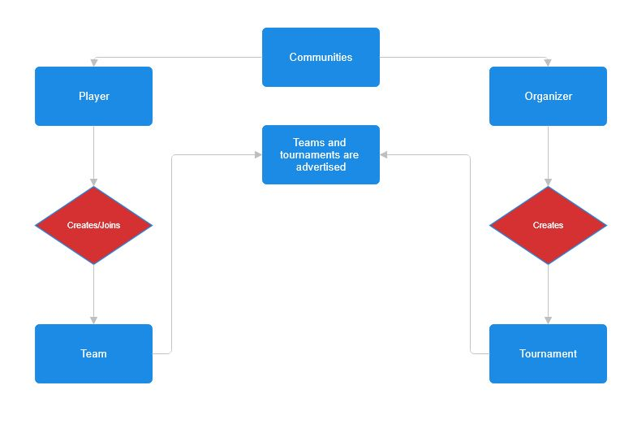
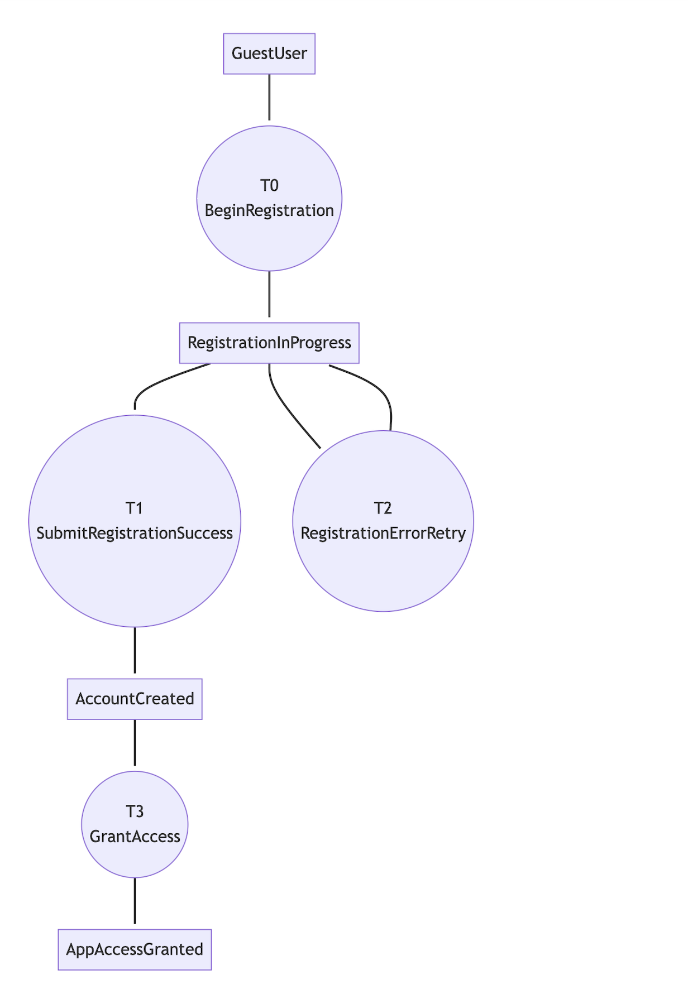
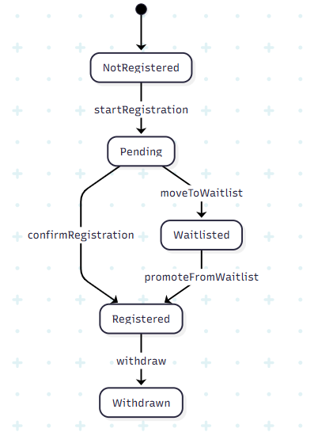
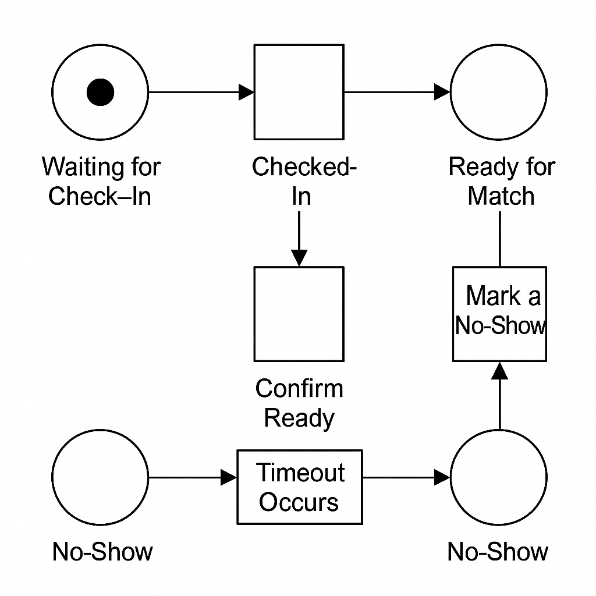

== 2 Descriptive Part

=== 2.1 Domain Description
This section describes the essential components and interactions within an the esports tournament platform. It defines how players, teams, and organizers interact through the platform and identifies the terminology and conceptual abstractions that structure the system. The description includes a rough sketch of the domain, key terms, a narrative of typical processes, and breakdowns of events, actions, behaviors, and function signatures.

=== 2.1.1 Rough Sketch
•⁠  ⁠[.hl-red]#Players register in a community and can either create new teams or join existing ones advertised within the platform.#

•⁠  ⁠[.hl-red]#Each team designates a captain, who manages invitations, roster changes, and tournament registrations.#

•⁠  ⁠[.hl-red]#Organizers publish tournament announcements with eligibility rules such as age limits, roster size, or regional restrictions.#

•⁠  ⁠[.hl-red]#Teams submit their rosters before the registration deadline, depending on the ruleset, limited roster chances may be permitted later.#

•⁠  ⁠[.hl-red]#Tournament seeding is determined by prior rankings, past results, or qualifiers.#

•⁠  ⁠[.hl-red]#Supported formats include single-elimination, double-elimination, Swiss, or round-robin.#

•⁠  ⁠[.hl-red]#Teams must check in before each match; missing a grace period may cause a forfeit.#

•⁠  ⁠[.hl-red]#Results are recorded; tiebreakers decide standings in round-robins or Swiss.#

•⁠  ⁠[.hl-red]#Spectators and media follow brackets, standings, and schedules.#

[.hl-green]#The following are statements people would say in their day to day life.#

•⁠  ⁠[.hl-yellow]#"Hey Carlos, I just wanted to say that im very glad I met you at the last tournament. I had a really difficutl time making friends and always wanted to be part of a community that enjoyed the same games as I do. Ever since joining the Smash Bros community here, Ive made a lot of good friends like you and have had a great time participating in events with them."#

•⁠  ⁠[.hl-yellow]#"Hey Fabian, Ive been playing Super Smash Bros day and night but dont have anyone to play against. I was thinking of organizing an event in a neat manner where I can find suitable opponents and make a fun competition for everyone. Would you be interested in helping me set it up?"#

•⁠  ⁠[.hl-yellow]#"What are we gonna do guys? We need one more member to complete the roster qualifications if we want to compete in the UPRM Marvel Rivals tournament in May. We need to make sure our team is registered two weeks before the tournament too. Any ideas on who we can invite to join us?"#

•⁠  ⁠[.hl-yellow]#"Alright people if we're seriours about forming our esports team we need to decide on a captain. This person will be in charge of inviting people, updating the roster and signing us up to tournaments. I think Tomas would be a great choice since he's organized and knows a lot about the games we play. What do you guys think?"#

•⁠  ⁠[.hl-yellow]#"Hi Maria, have you seen the requirements posted on the site for the Mario Kart Tournament in February? The organizers stated that you have to be older than 13. They also mentioned that teams need to have 4 members and only people from the west side of the island can enter this specific tournament. Would you be interested in participating with me? Im looking for people from campus that live around here like me in order to be able to form my team."#

•⁠  ⁠[.hl-yellow]#"Hi are you one of the organizers for the tournament? I just wanted to say that I noticed how you didnt just put teams randomly in a bracket; instead it seems that teams where seeded based on how well they did in previous tournaments or online qualifiers. I think that was a great idea since I could see and experience first-hand how it made the competition more balanced and fair for everyone."#

•⁠  ⁠[.hl-yellow]#"Oh hi Gabriela! Sorry I havent been able to go out with you much this month. Ive been really busy competing on events around the island. Its been fun to play in events with different formats. Some are single elimination so you lose once you're out. Others are double elimination, round robin or that Swiss system where you keep playing people with similar records. Although I've been busy with the torunaments and school work I've had a grat time and have met a lot of people passionate about the same games as me."#

•⁠  ⁠[.hl-yellow]#"Hey team, just a reminder that we have a match coming up this Saturday at 3 PM. Make sure to check in on the website at least 15 minutes before the match starts. If we dont check in within the grace period, our team will automatically forfeit the match. Let's make sure we're all on time and ready to play!"#

•⁠  ⁠[.hl-yellow]#"Bro, last night's match was insane! Since after every match  score were reported you could see how close each team was to winning. I remember in a round robin tournament two teams ended with the same number of wins, so they had to use things like head-to-head results or point differences to decide who placed higher. It made every point count, and it was so exciting to watch!"#

•⁠  ⁠[.hl-yellow]#"The popularity the esports community is gaining is surprising. Even people who aren’t playing still follow everything. I heard on reddit that some people keep checking the brackets, match schedules, and standings to see who is winning and who got knocked out. Some even stream or share updates on Instagram and Facebook. Yesterday I even heard my grandma talk about how some kid won a five thousand dollar price on Fortnite tournament in Alabama. It's amazing to see how much interest there is in esports nowadays!"#

Figure 2.1.1 – Tournament and Community Interaction Flow.
This diagram illustrates the relationship between players, organizers, and communities. In this diagram:
- **Blue rectangles** represent entities (players, teams, organizers, communities).
- **Red diamonds** represent actions (register, create, update, check-in, etc.).
- **Arrows** indicate the flow of interactions or dependencies between entities and actions.
If you want to focus on entities, a class diagram could be used, with relations labeled by the actions they enable. Since this is not a standard UML diagram, the graphical elements are explained above for clarity.

=== 2.1.2 Terminology
- *Player*: An individual who registers on the platform to participate in esports tournaments.
- *Team*: A structured group of players with shared identity, team name, scorem and confirmation status (isConfirmed), led by a captain.
- *Captain*: A designated team member responsible for managing team activities, including roster changes and tournament registrations.
- *Tournament*: A competitive event where teams compete against each other in a structured format.
- *Match*: A single game or series of games played between two teams within a tournament
- *Organizer*: An individual or group responsible for setting up and managing tournaments.
- *Spectator*: An individual who watches the tournaments and follows the progress of teams and matches.
- *Community*: A group of players and teams that share common interests and participate in tournaments together.

=== 2.1.3 domain terminology in relation to domain rough sketch
[.hl-green]#The Rough Sketch describes the dynamic, real-world actions that occur within the platform, such as “team registration,” “match reporting,” or “roster updates.” These represent domain events and procedural details observed in operation.#

* The Terminology section abstracts these raw observations into reusable, stable concepts. For example:
* “15-minute grace period” → becomes Check-In Policy
* “Missed match due to delay” → becomes Forfeit Event
* “Map veto order” → becomes Match Preparation Protocol
* “Roster changes allowed until Day 1” → becomes Roster Update Policy

[.hl-green]#This abstraction process establishes consistency across the documentation, allowing the same concept (e.g., “check-in”) to be used precisely throughout requirements, design, and implementation. It also enables closure, where each defined concept connects seamlessly to a corresponding function or entity in the system model (e.g., a Team object includes isConfirmed to represent check-in status).#

=== 2.1.4 Expanded Narrative

The esports tournament domain is structured around several key concepts: tournaments, teams, matches, organizers, communities, and stages. A **stage** is a phase in the tournament lifecycle (e.g., registration, bracket generation, match play, results update, closure). Each stage has its own rules, actions, and transitions.

The process begins with an organizer announcing a tournament, specifying its format, rules, and registration window. Players form teams, designate captains, and register for the event. During the registration stage, eligibility is checked (account status, ranking, roster size). If too many teams register, a waitlist is created. When registration closes, the bracket is generated—often as a binary tree for single-elimination, or other structures for Swiss/round-robin formats. Teams may receive byes if the participant count is not a power of two.

As the tournament progresses through its stages, matches are played round by round. Winners advance to the next stage, losers are eliminated. After each match, results are updated, scores are recorded, and tiebreakers may be applied. The final stage is closure, where results are published and rankings updated. Throughout, communities and spectators follow progress, and organizers manage logistics and communications.

The narrative covers the full lifecycle, emphasizing how each stage (registration, bracket generation, match play, results, closure) plays a distinct role in the domain. The concept of "stage" is central: it structures the flow, determines available actions, and governs transitions between phases.

=== 2.1.5 Unified Domain Concepts and Operations

Entities, actions, events, and behaviors are all phenomena in the esports domain. They are not separated into distinct sections, but are described together to show how they interact and support domain observations.

- **Entities**: Team, Tournament, Match, Player, Organizer, Community, Stage
- **Actions/Operations**: Create tournament, register team, generate bracket, assign captain, update match result, record forfeit, send notification, perform map veto, check-in team
- **Events**: Registration window closes, match completed, bracket generated, player disconnect, roster update deadline reached
- **Behaviors**: Run tournament flow, handle registration, update bracket progression, manage real-time updates

Each action/operation is paired with its function signature, showing how it expresses domain observations. For example:

* **registerTeam(team, tournament)**: Used when a team registers for a tournament. The function requires a team and a tournament; teams are created by players, tournaments by organizers. If you need a team, use a function like `createTeam(player, name, ...)` (not shown here, but implied by the domain).
* **updateTeamScore(teamID, points)**: Updates a team's score. Points may be produced by match results, so the function should clarify where points come from (e.g., `recordMatchResult` returns points). If you have only a teamID, you may need to resolve it to a team object via the tournament or a lookup function. Alternatively, `updateTeamScore` could take a team object directly, or the Match object could be responsible for updating scores for all teams involved.

These decisions require discussion and negotiation among the project team. For example, should `updateTeamScore` take a teamID or a team object? Should the Match object update scores for all teams? Each approach has tradeoffs and may require changes to the implementation. The function signatures are grouped with their actions/operations to clarify how they support domain scenarios.

=== 2.1.6 Function Signatures (Grouped with Actions)

Function signatures define how operations are represented programmatically, describing inputs, outputs, and failure conditions. They are grouped with their corresponding actions/operations to clarify how they support domain scenarios and observations.

Figure 2.1.2-Account Creation Flow 

* **createTournament(organizer, name, format, maxSlots, rules) → Tournament | Failure**
	- Creates a new tournament entry with defined parameters.
* **registerTeam(team, tournament) → Confirmation | Waitlist | Denied**
	- Registers a team if it meets eligibility requirements and if slots are available.

Figure 2.1.3 - Example registration flow

* **generateBrackets(tournament) → BracketStructure | Failure**
	- Creates a bracket layout based on participant count and format (single/double elimination).
* **recordMatchResult(matchID, winnerID, score) → UpdatedBracket | Failure**
	- Updates match data and propagates the winning team to the next round.
* **updateTeamScore(teamID, points) → UpdatedTeam | Failure**
	- Adjusts a team’s total score and updates leaderboard standings. Points are produced by match results.
* **checkInTeam(teamID, tournamentID) → StatusUpdated | Timeout**
	- Verifies attendance before match start; returns timeout if grace period expires.
    

Figure 2.1.4 -Example check in flow

Each function maintains closure within the domain: the output (e.g., a BracketStructure or UpdatedTeam) can directly serve as input to another function in the system, supporting modularity and composability in software design.

Design decisions about function parameters (e.g., using teamID vs. team object, updating scores via Match or Team) should be discussed and negotiated by the project team. Implementation may need to be revised as the domain model evolves.
