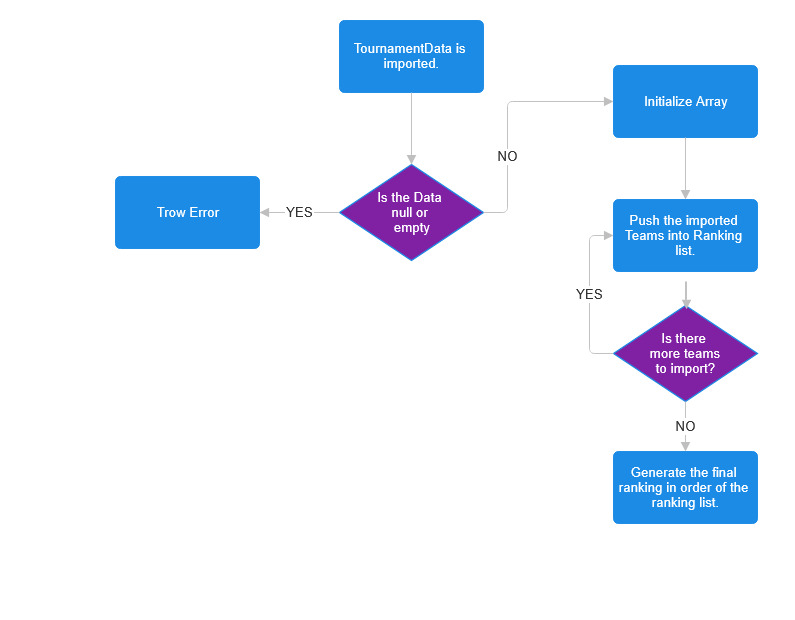

Figure Result Report Interaction Flow.
This diagram illustrates the flow of the result report creation process.  

- **Blue rectangles** represent actions (Create array, trow error, etc).
- **Purple diamonds** represent questions (Is the data empty?, Are there more teams to import.).
- **Arrows** indicate the flow of interactions.

=== 2.1.2 Terminology
- *Tournament Data*: Data on the tournamnets, final standing, KDA etc. used to create the final ranking list.
- *Ranking array*: Final ranking list. every team is placed on the order of where they finished on the ladder.