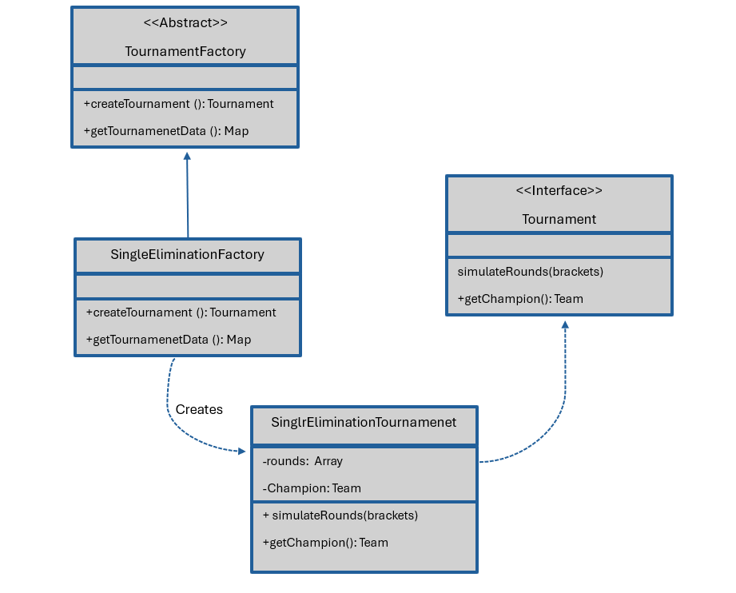

= Classification patterns in tournament
Juan L. Muñiz Ramos - October 14, 2025

== Design patterns
 
 Ther are a general and applicable solution to different software desing problems. thse are templates that identify problems in the approach to problem-solving. It helps to share efficient and effective solutions. It cannot be expressed in programming language. It is souce code oriented.

 Type of desing patter to be used:

    * Creational patterns

== Creational patterns

Ther provide various object creation  mechanisms, where they increase the flexiblility and reusability of the code. We are going to use Factory method.

*Types of Creational patterns*

* Abstract Factory
* Builder Patterns
* Factory Method
* Prototype

== Factory Method

An interface for creating objects in a super class, allowing subclasses to alter the type of objects to be created.

== Factory method Diagram for tournaments

== References 

* https://profile.es/blog/patrones-de-diseno-de-software/#%C2%BFQue_son_los_patrones_de_diseno_design_patterns
