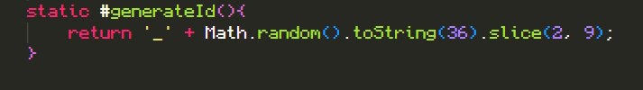

= How encapsulation can be implemented in Post class
Juan L. Muñiz Ramos - November 15

== What is encapsulation 

Is a way to keep the related properties and method under a single namespace by bunding them. It can be a function, a class or an object. In javaScript, the encapsulation can be implemented using clousures, classes and getters and setters.

Encapsulation is a fundamental concept in Object-oriented programming, along with inheritance and polymorphism. 

It is used to hide the data from the outside world and give access to required data only to improve the integrity and security of the data.

== Benefits of using encapsulation in Post class

* Protects the internal state of an object(Avoid direct and invalid changes).
* It allows you to validate entries 
* Avoid reference leaks like returning copies of arrays or objects.
* Facilitates refactoring: Changing internal implementation without breaking other parts of the code
* Improves testing: No need to test implementation of methods that are not to be used outside the Post class.

== Implementation done on Post Class

    Image of what was implemeted encapsulation in the post class.

image::How_encapsulation_can_ be_implemented_in_Post_class.png[Image of implementation in encapsulation, 1947, 1047]

Here where the changes that were made to the Post class to implement encapsulation.

* Most of the functions, getters, and setters cannot be encapsulated because they are functions that developers need to create post requests; therefore, `generateId` was the only one that should not be used outside the class.

* This causes developers who are using the class with their object not to use this function, and intentionally and constantly change the user's ID.

* The 'Likes' property can be encapsulated, as it doesn't validate if the like values are negative, but this won't be done since this review of the code allows me to improve the function code to avoid problems with 'Likes' validation.

== Learning Outcome

This exercise has made me realize several errors made when the class was implemented by myself, where changes will be made to improve the implementation of the Post class.