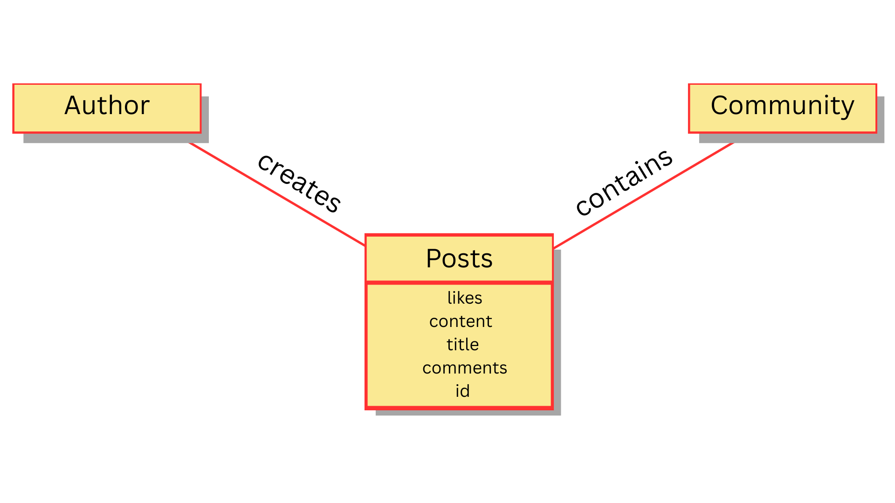

= Posts Class Diagram
Entities:
posts: Image and text published by a member of community.
community: An entity that represents a group of users with similar interests. When a post is part of a community, it can appear on the feed of that community.
author: Represents a user that creates the post.
content: Represents the image and/or strings uploaded by the author. 
title: String that represents the name and subject of the post.
likes: Integer that represent the amount a user appreciation or approval of content of the post.
comment: Represents a string created by a user replying to the content of the post.
id: String used to identify and differentiate the post in the database.

Figure 1: Class diagram for Posts

The class diagram created shows and demonstrates the behavioral relationships among the entities, actors, and classes in the posts class. It can facilitate developers easily comprehend how posts function to effortlessly develop and implement related features.   