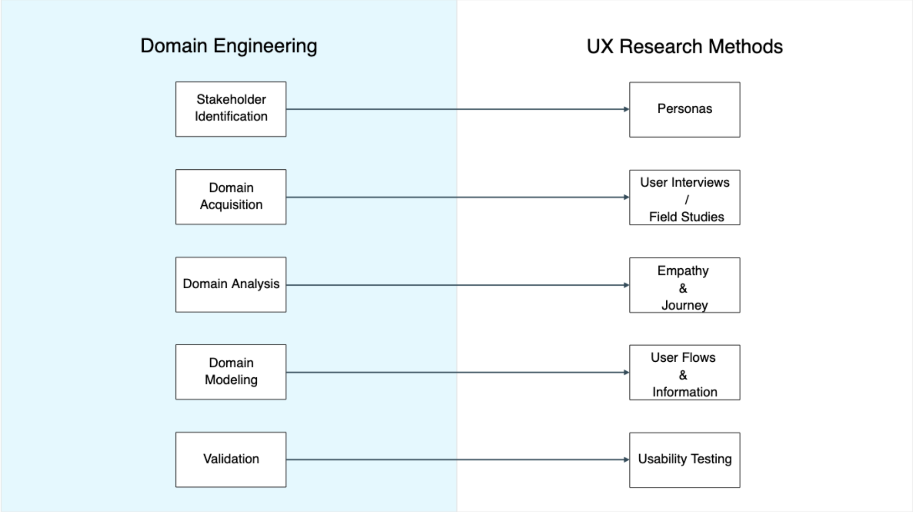

= Domain Engineering as a Foundation for UX Research
Ronaldo Elier Flores Nazario, November 13, 2025

== Introduction
Domain Engineering is a systematic approach to understanding complex systems by identifying stakeholders, gathering domain knowledge, analyzing behaviors, and validating models.  
These principles are essential not only in software engineering but also in user-centered design: the better the understanding of the domain, the stronger the foundation for UX decisions.

By applying domain engineering, UX researchers better understand the environment in which users operate—making personas more valid, interviews more productive, and interface requirements more grounded.

== Key Stages of Domain Engineering

=== Stakeholder Identification
This stage determines everyone who interacts with, depends on, or influences the system, including:
* Administrators
* End-users
* Domain experts
* Supporting roles
* External entities

=== Domain Acquisition
This stage gathers raw domain knowledge through:
* Documents  
* Interviews  
* Observations  
* System exploration  

The focus is on understanding what exists before modeling or interpreting.

=== Domain Analysis
Processes collected information to identify:
* Entities  
* Behaviors  
* Rules  
* Constraints  
* Relationships  

This produces structured insights that define the system holistically.

=== Domain Modeling
This stage creates formal representations such as diagrams, conceptual models, and workflows.  
These models communicate system logic across stakeholders and ensure alignment during design.

=== Validation
Models must be validated to ensure they correctly represent the real domain.  
This involves reviewing with stakeholders, experts, and through system behavior.

== Relationship Between Domain Engineering and UX Research
Domain engineering supports modern UX methods by providing a structured way to understand people, systems, and environments.

=== Stakeholder Identification → Persona Creation
Accurate personas rely on real domain roles:
* Goals  
* Motivations  
* Responsibilities  
* Context  
* Constraints  

=== Domain Acquisition → User Interviews
Aligned with UX methods such as:
* Semi-structured interviews  
* Contextual inquiries  
* Surveys  
* Field studies  

Both aim to gather authentic data from the right people.

=== Domain Analysis → Empathy & Journey Mapping
Domain analysis supports synthesis tools:
* Empathy maps  
* Journey maps  
* Storyboards  

By analyzing entities and behaviors, teams identify workflow patterns, pain points, and user needs.

=== Domain Modeling → UX Requirements & Prototyping
Domain models translate into:
* Interface requirements  
* Feature scopes  
* Low-fidelity prototypes  
* Interaction maps  

This ensures UX reflects real domain structure.

=== Validation → Usability Testing
Just as models must be validated with stakeholders, prototypes must be validated with users.  
Both ensure the design aligns with reality, not assumptions.

== Feature Example: Applying Domain Engineering to a Real Project
Consider a feature like a *Medication Tracking Module* from a medication-management app.

Feature: *Tracking when a caregiver administers a medication.*

=== Stakeholder Identification
* Elderly residents  
* Caregivers  
* Administrators  
* Medical supervisors  

Different roles reveal different needs: speed for caregivers, accuracy for supervisors.

=== Domain Acquisition
Interviews reveal:
* Caregivers multitask during rounds.  
* The app should reduce cognitive load.  
* Some medications require double confirmation.  
* Logging errors increase during peak hours.

=== Domain Analysis
Identified:
* Entities: medication, schedule, caregiver, participant  
* Behaviors: confirm, administer, log, update  
* Policies:  
  - “Administration must be timestamped.”  
  - “Some meds require supervisor approval.”  
  - “A dose cannot be logged twice.”

=== Domain Modeling
A workflow diagram identifies friction points:
1. Select resident  
2. Show schedule  
3. Verify dose  
4. Log administration  
5. Add annotation  

This produces clearer UI flows.

=== Validation
Caregivers review the model and reveal missing steps—for example, packaging may require additional confirmation screens.

=== Direct UX Impact
Understanding the domain ensures the UI includes:
* Clear steps  
* Real-world rules  
* Relevant confirmation features  
* Reduced medication log errors  

== Domain Facets in Their Connection to Interface Design

=== Rules → UI Constraints
If a medication cannot be administered twice, the UI must:
* Disable the button  
* Show a warning  
* Log the attempt  

=== Procedures → Workflow Organization
If staff follow a 5-step real-world process, the UI must mirror that sequence.

=== Human Behavior → Usability Considerations
If caregivers work under time pressure, the UI must be:
* Fast  
* Simple  
* Predictable  
* Low-error  

Domain facets ensure the interface respects how the domain truly operates.

== Diagram: Mapping Domain Stages to UX Research Methods

== Conclusion
Domain Engineering provides a powerful foundation for UX Research.  
By systematically understanding stakeholders, behaviors, rules, and domain structures, designers create:

* More accurate personas  
* Grounded user flows  
* Meaningful interface requirements  
* Systems that reflect real-world needs  

Following domain principles ensures UX work is not based on assumptions but on structured, validated domain knowledge.