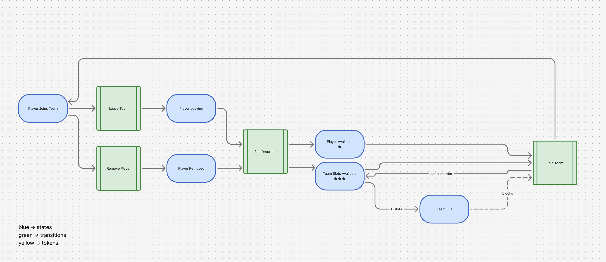
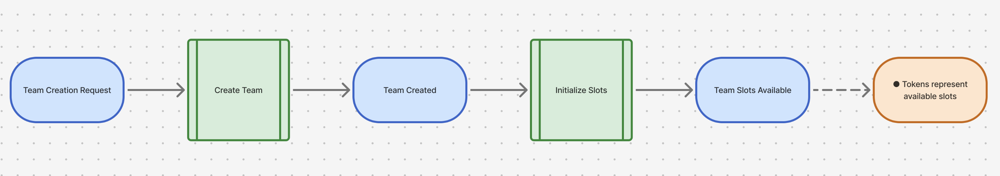

Petri Net Documentation

---

Summary and Key:

This document summarizes the two Petri Nets used to model the *Team Creation* and *Team Join* processes in the webapp. 
Each diagram shows how states, transitions, and tokens ensure valid and concurrency-safe behavior.

* **Blue** - States  
* **Green** - Transitions 
* **Black dots** - Tokens 

---
Team Join Petri Net - This net models how players join or leave teams while enforcing slot limits.

* Players may join only if at least one slot token is available.  
* Leaving or removing a player returns a slot token.  
* When no tokens remain, the team is full and join requests are blocked.  

---
Team Creation Petri Net - This net describes how a team is created and how its initial slot tokens are assigned.

* A team is created after a valid request.  
* Once created, the system initializes the teams slot availability.  
* Tokens represent the number of open roster positions.  

