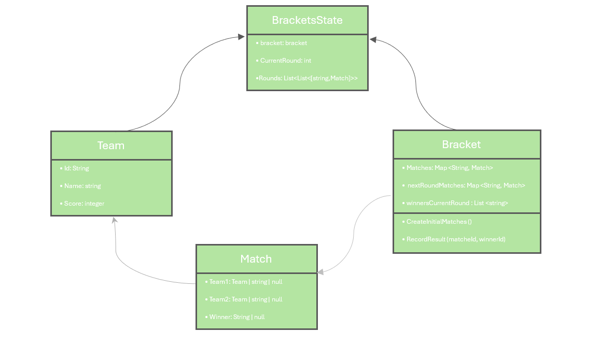

= Performance Requirements in Tournaments
Juan L. Muñiz Ramos - November 11, 2025

== 1. Performance requirements foqr tournaments

Performance requierements are impotatnt in tournaments helps us to ensur that all the teams can play at a even levelThis includes aspects such as:

* Minimun specefication of hardware: All teams participating in the tournament mus have the minimun hardware spefications to run the tournament.
* Internet connection: Needs to be stable enough to avoid lag or disconnections issues during matches.
* Software version: All the teams must have the lates version of the game to be hable to play without any issues.

== 2. A little about performance requirements

Performance requirements are  contractual obligation that define the minimum standerds, outputs, or results of party must achive in delivering goods, services, or compliting a proyect.This includes such as: timelines,equalines,quality leves, service availability, functionality, or other outcomes. 

== 3. Complexity of tournaments

* Number of matches: Has a complexity of O(n-1) where n is the number of teams participating in the tournament.

* Total work done: Is aproximately O(n^2) since it serchs linearly through all the teams to make matchups.

== 4. Diagram of how tournaments would look with a performance requirements

The diagram represents how performance requirements can be implemented in tournaments to ensure fair play of all teams.

1. Bracketstate: Keeps track of the states of the tournament brackets.
2. Team: Represents each team participating in the tournament.
3. Match: Represents each match played between teams in the tournament.
4. Bracket: Represents the tournament matches on brackets.
