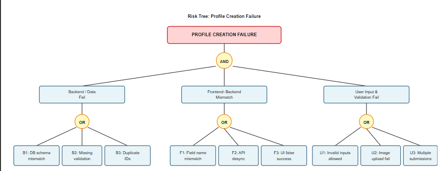

= Risk Tree and Analysis for Profile Creation Feature
:toc:
:toclevels: 3

== Introduction
This document presents a risk analysis and risk tree for the *Profile Creation* feature of the Esports Organizer Manager.

The risk tree identifies *what can go wrong* in the subsystem and how failures propagate through inconsistent specifications, documentation gaps, or implementation issues. Profile creation is a critical first step for users, making its reliability essential.

This analysis aligns with the *Identifying and Resolving Inconsistencies* lecture topic task, since many risks originate from terminological, structural, behavioral, or process inconsistencies among teams.

== Purpose of the Analysis
The purpose of this risk analysis is to:

* Identify the **top failure event** for profile creation.
* Decompose the failure into risk categories using a structured risk tree.
* Map risks to inconsistency categories covered in lecture.
* Define mitigation strategies for each branch and leaf.
* Provide a clear reference for development, testing, and maintenance tasks.

This document does not describe the entire implementation but focuses on vulnerabilities and how to mitigate them.

== Top Event (Root of the Risk Tree)

* Top Event:* _Profile Creation Failure or Inconsistent User Profile_

Examples:
* Required data missing from the saved profile.
* Duplicate accounts due to missing unique constraints.
* UI shows success while backend fails to persist data.
* Conflicting profile states across API, UI, and database.

== ASCII Risk Tree Diagram

[%center]

== Risk Tree Structure

The risk tree decomposes the top event into three major branches:

1. Backend Logic and Data Model Risks  
2. Frontend–Backend Inconsistency Risks  
3. User Input and Validation Risks  

These branches reflect the most common failure modes during profile creation.

== 1. Backend Logic and Data Model Risks

[cols="1,3,3", options="header"]
|===
| Risk ID | Description | Example Consequence

| B1 | Database schema mismatch between environments | Crashes or missing fields
| B2 | Missing server-side validation | Invalid profiles saved
| B3 | No unique constraints on identifiers | Duplicate accounts created
|===

Mitigation strategies:

* Centralize and document the canonical profile schema.
* Add strong backend validation and uniqueness constraints.
* Use atomic transactions for profile creation.

== 2. Frontend–Backend Inconsistency Risks

[cols="1,3,3", options="header"]
|===
| Risk ID | Description | Example Consequence

| F1 | Mismatched field names (`email` vs `user_email`) | Profile missing required information
| F2 | Different required/optional rules across teams | Broken or inconsistent UI/UX
| F3 | UI shows success while backend fails | User believes account exists when it does not
|===

Mitigation strategies:

* Maintain a synchronized OpenAPI/Swagger spec.
* Include API contract validation in CI.
* Integrate this into the `Inconsistency_Audit.md` process.

== 3. User Input & Validation Risks

[cols="1,3,3", options="header"]
|===
| Risk ID | Description | Example Consequence

| U1 | Weak client-side validation | Bad emails, empty usernames
| U2 | No file validation for profile images | Unsupported files cause crashes
| U3 | No protection from rapid double submissions | Duplicate accounts or duplicate requests
|===

Mitigation strategies:

* Strong real-time frontend validation.
* Disable submit button when processing.
* Add image upload constraints.

== 4. Communication and Documentation Risks

[cols="1,3,3", options="header"]
|===
| Risk ID | Description | Example Consequence

| C1 | Terminology mismatch (DisplayName vs Username) | Confusing mapping logic
| C2 | Required/optional fields not documented | Teams implement different rules
| C3 | Outdated documentation | Old API assumptions remain in code
| C4 | No centralized decision record | Repeated inconsistencies across teams
|===

Mitigation strategies:

* Maintain a Profile Data Glossary.
* Require documentation updates in pull requests.
* Track profile-related inconsistencies in the Discord `#inconsistencies_channel`.

== 5. Security and Data Integrity Risks

[cols="1,3,3", options="header"]
|===
| Risk ID | Description | Example Consequence

| S1 | Weak password rules | Insecure accounts
| S2 | Missing HTTPS or encryption | Sensitive data at risk
| S3 | No email verification | Fake profiles; recovery problems
| S4 | No concurrency protection | Duplicate or corrupt profiles
|===

Mitigation strategies:

* Enforce strong password rules on server and client.
* Require HTTPS in all environments.
* Add email verification workflow.
* Add uniqueness constraints and concurrency protections.

== Link to Lecture Topic Task: Identifying Inconsistencies
Many of the risks originate from inconsistencies:

* Terminology (C1, F1)
* Structure (B2, F2)
* Behavioral (F3)
* Process (C3, C4)

== Benefits to Project Development
A risk tree yields:

* Visibility into failure modes  
* Prioritization of high-impact risks  
* Traceability across documentation, tasks, and commits  
* Clear integration with algebraic and TLA+ models  

== Conclusion
This integrated risk analysis and risk tree formalize the main failure paths for Profile Creation in the Esports Organizer Manager system.  
By mapping risks to inconsistency categories and mitigation strategies, teams gain a structured approach to improving reliability, clarity, and long-term maintainability.

