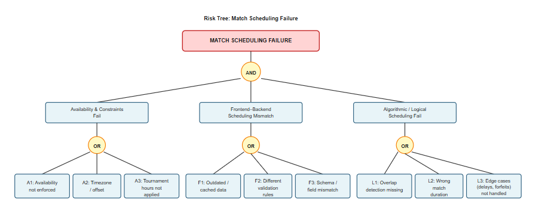

== Risk Tree and Analysis for Match Scheduling

=== Introduction
This section presents a risk analysis for the *Match Scheduling* subsystem of the Esports Organizer Manager.  
Match scheduling is a core feature that coordinates when teams or players compete, ensuring no time conflicts, respecting availability constraints, and maintaining consistency between the UI, the backend system, and stored match data.

Scheduling errors can cause overlapping matches, invalid brackets, incorrect times, or missing schedule updates.  
This risk analysis decomposes these potential failures into structured branches that illustrate where inconsistencies or design flaws could arise.

=== Purpose of the Analysis
The purpose of this analysis is to:

* Identify the **top scheduling failure event**.
* Decompose the failure into clear root causes using a fault-tree structure.
* Highlight inconsistencies that may arise across documentation, API contracts, availability data, and UI.
* Provide mitigation strategies that can be integrated into development, verification, and documentation workflows.
* Support future improvements such as formal verification, conflict detection, or team-specific validation tools.

This analysis focuses on *why* scheduling might fail, not *how* the scheduling algorithm is implemented.

=== Top Event: Match Scheduling Failure

*Match Scheduling Failure*  

A scheduling failure occurs when the system produces an invalid, contradictory, or unusable match schedule.

Examples include:

* A match overlaps with another match for the same player/team.

* A match is scheduled outside allowed tournament hours.

* A match time does not reflect player availability.

* The front-end shows a different schedule than the backend.

* A match is created without essential data (start time, participants, location).

=== Risk Tree Structure

[%center]

=== Risk Tree Structure and Branches

The following sections describe the major risk branches and additional areas that may contribute to the Match Scheduling Failure top event.

=== 1. Availability and Constraint Risks

[cols="1,3,3", options="header"]
|===
| Risk ID | Description | Example Consequence

| A1 | Player or team availability not enforced | User assigned to two matches at once
| A2 | Timezone mismatch or misinterpreted offset | Match appears at different times for different users
| A3 | Tournament-wide constraints not applied | Match scheduled outside allowed hours
|===

Mitigation strategies:
* Normalize all scheduling data.
* Validate all matches against availability blocks.
* Provide visual conflict detection for organizers before saving schedules.

=== 2. Frontend–Backend Scheduling Inconsistencies

[cols="1,3,3", options="header"]
|===
| Risk ID | Description | Example Consequence

| F1 | UI uses cached or outdated schedule data | Users see incorrect match times
| F2 | Backend applies different validation rules than UI | UI allows a time but backend rejects it later
| F3 | Different field names or schema mismatches | Missing or incorrect scheduling properties
|===

Mitigation strategies:
* Synchronize schedule schema.
* Require documentation updates in PRs for schedule-related changes.
* Cache-invalidate schedule data aggressively after updates.

=== 3. Algorithmic and Logical Scheduling Risks

[cols="1,3,3", options="header"]
|===
| Risk ID | Description | Example Consequence

| L1 | Scheduling algorithm does not detect overlapping matches | Players double-booked
| L2 | Algorithm assumes incorrect duration values | Matches spill into each other
| L3 | Edge cases not handled (byes, delays, forfeits) | Schedule breaks tournament flow
|===

Mitigation strategies:
* Add automated overlap detection.
* Centralize match duration constants.
* Implement test cases for drag-and-drop, manual overrides, and last-minute changes.

=== 4. Communication and Documentation Risks

[cols="1,3,3", options="header"]
|===
| Risk ID | Description | Example Consequence

| C1 | Ambiguous definitions (e.g., “start time” vs “ready time”) | Teams interpret schedule incorrectly
| C2 | Schedule rules not shared across teams | Mismatched validation logic
| C3 | Incomplete documentation of manual vs. automatic scheduling | Incorrect assumptions during implementation
|===

Mitigation strategies:
* Maintain a glossary for scheduling-related terms.
* Add a scheduling policy section to the project wiki.
* Track scheduling inconsistencies.

=== 5. Data Integrity and Storage Risks

[cols="1,3,3", options="header"]
|===
| Risk ID | Description | Example Consequence

| D1 | Match time stored inconsistently across DB tables | Conflicting schedule information
| D2 | No uniqueness constraint for match slots or match IDs | Duplicate or ghost matches
| D3 | Corrupted schedule after partial update | UI displays broken schedule
|===

Mitigation strategies:
* Ensure atomic database operations.
* Add integrity constraints to the schedule table.
* Log every schedule update with timestamps.

=== Link to Lecture Topic Task: Identifying Inconsistencies

Many of these risks stem directly from inconsistencies:

* Terminology clashes: C1  
* Structure mismatches: F3, D1  
* Behavioral discrepancies: F2, L1  
* Process/documentation issues: C2, C3  

The risk analysis supports the Identifying Inconsistencies task by showing where mismatches propagate into real scheduling failures.

=== Conclusion

This risk analysis provides a structured breakdown of how *Match Scheduling Failure* can occur in the Esports Organizer Manager system.  
By identifying inconsistencies and weaknesses in constraints, documentation, algorithms, and data integrity, the team can apply targeted mitigation strategies.  
This improves reliability, usability, and maintainability for all match-related features.

