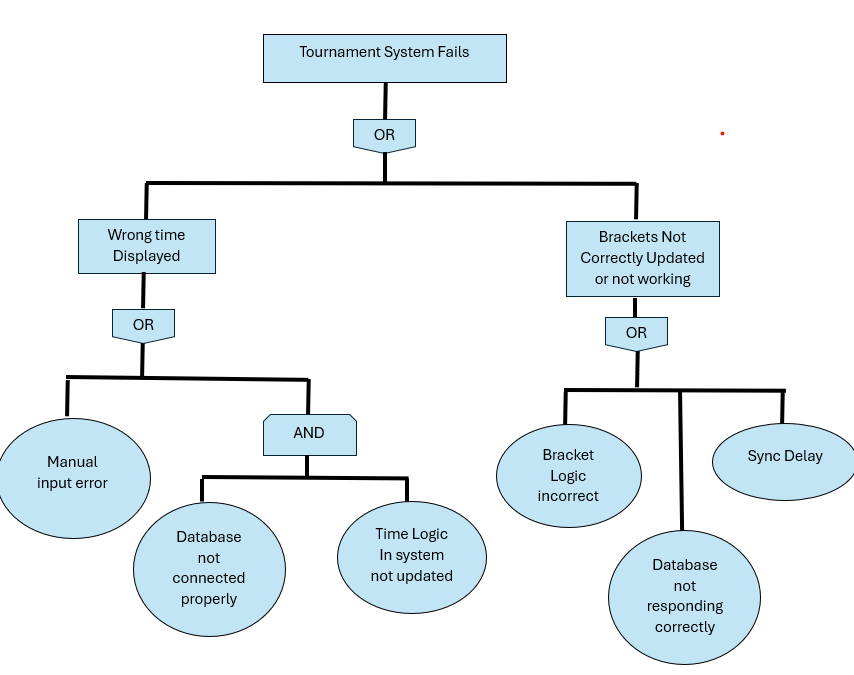

== Risk Analysis Tree for Tournaments
---
= Introduction
Risk Trees help identify the potential errors or failure points a program might encounter. By breaking down risks into smaller, traceable causes, they allow testers to design more targeted and efficient test cases. This structured view not only improves test coverage but also helps developers anticipate where bugs, crashes, or unexpected behaviors are most likely to occur during execution. 

= Analysis

Tournaments system can fail in some ways that could be fatal to the product. The first thing that could disrupt the process of tournaments would be the Time display not being correct. This could cause players to miss matches or lose time. This could happen because of a manual input error caused by the manager, but it could also be because the time logic in the system is not updated and database not provide the correct information for the program. 
Another issue that could interfere with a tournament would be Brackets not updating or failing. This could be caused by Incorrect bracket logic which would mean that brackets do not show up how they are supposed to. There could be a Sync delay within the tournaments causing brackets to show incorrect or incomplete information to a user. Database not responding correctly could also damage the integrity of the brackets since nothing would appear to a user causing a disruption to the process of tournaments in the program.
Overall, these risks emphasize the importance of reliable database connectivity and well-designed system logic. By addressing these potential failures, developers and testers can ensure that tournaments run smoothly and maintain their integrity.
