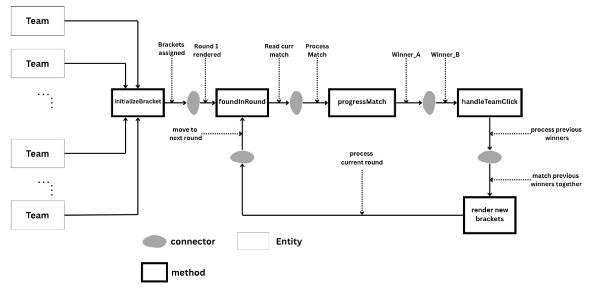

.Tournament Software Design Diagram from Performance

This Software Design diagram emphasizes the performance aspects of the tournament system by diving deeper into the methods and abstract processing.

1. Teams that are registered are seeded into brackets.
2. The first round of matches is generated and rendered based on the seeded teams.
3. The system identifies the current round to allow for appropriate match generation and winner input.
4. A match is created between two teams, and the winner is recorded as an input.
5. Once two winners have been determined, they are paired for the next round of matches and their bracket is rendered.
6. This process continues until a final winner is determined and the tournament concludes.

This design focuses on the efficiency of match generation, winner recording, and bracket rendering to ensure smooth tournament progression.