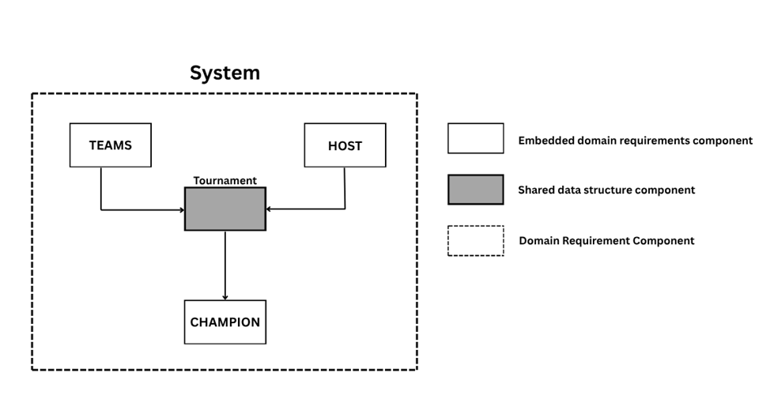

.Tournament Software Design Diagram from Requirements

The Software Design diagram represents the most abstract instance of the tournament system. 

1. The host creates the tournament
2. The teams enter the tournament
3. The tournament outputs a champion
