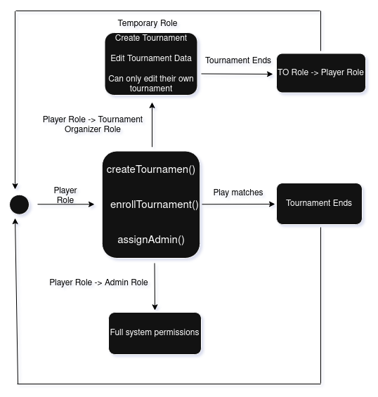

The model illustrates how user roles evolve dynamically based on actions within the tournament platform.
All users begin as Players, who can either participate in tournaments or create one. When a Player creates a tournament,
they transition into the Tournament Organizer (TO) role, gaining temporary permissions to manage only the tournament they created.
Once the tournament ends, their role automatically reverts back to Player. Separately, an Admin role can be granted by an existing Admin,
giving full system-level permissions for moderation and platform oversight. The diagram captures how role transitions depend strictly on
user actions like creating a tournament or being promoted by an Admin, ensuring clear boundaries between Player, TO, and Admin capabilities
while preventing unauthorized escalation of privileges.