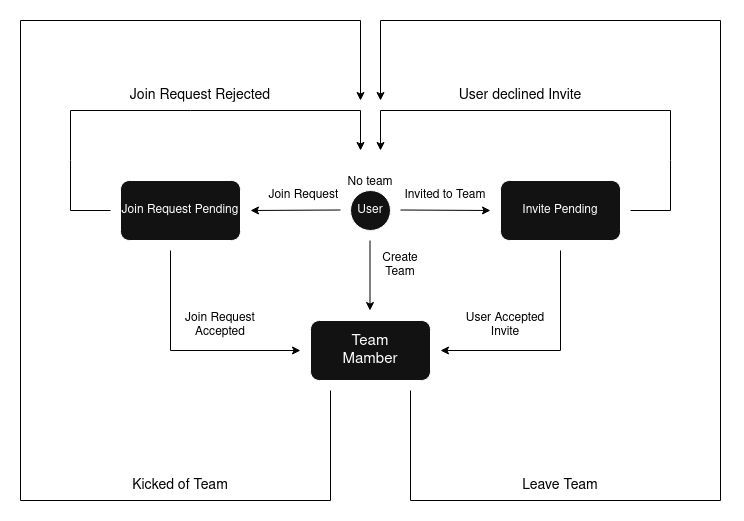

The state model illustrates the complete lifecycle of a user’s membership within a team, beginning in the No Team state, where the user may
either request to join an existing team or receive an invitation from a team member. A join request moves the user into the Join Request
Pending state, where they remain until the team accepts or rejects the request. Similarly, receiving an invitation places the user in the
Invite Pending state, where they can accept or decline. Acceptance from either path transitions the user into the Team Member state, where
they fully participate as part of the team. As a team member, a user can leave the team voluntarily, returning to the No Team state, or be
removed by the team leader for moderation purposes, also leading back to No Team. Additionally, a user can create a team directly from the
No Team state, instantly becoming the team leader and entering the Team Member state. This model ensures that users can only belong to one
team at a time, preventing contradictory or impossible membership states.