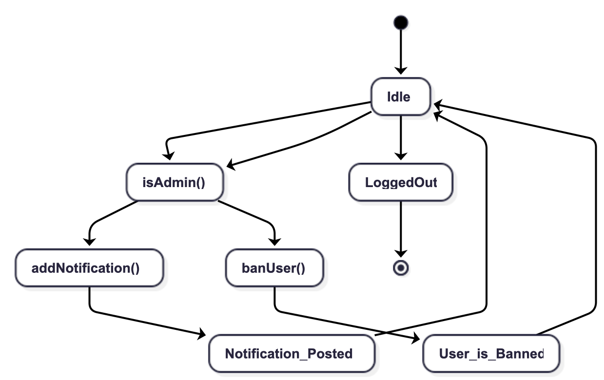

This state diagram illustrates the various states and transitions associated with the admin role within the system. The admin role is a role with elevated permissions, some of them being being able to ban users, make notifications. In this state diagram, we can see the different states the admin role can be in, as soon as an user with the admin role logs in the starting state we enter in is the idle state. From there, assuming that the fucntion isAdmin() returns true, the admin can perform actions such as banning users or making notifications, which transition the state to "Banning User" or "Making Notification" respectively. After completing these actions, the state returns to "Idle". The diagram also includes transitions for logging out, which leads to the end state.